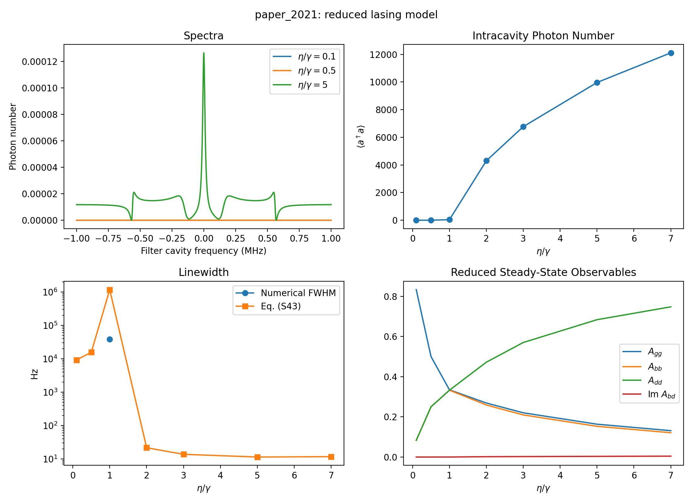
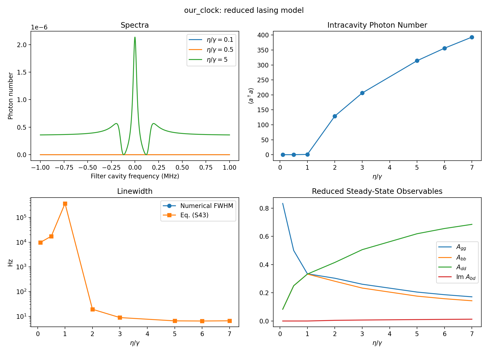

# Results Summary

This repository implements the reduced no-optical-coherence model from Moelmer et al. for the dark-state superradiant laser. The current production scripts use explicit branch finding and select the narrow lasing branch with `--branch-strategy minimum_linewidth`.

The main generated tables are:

- `results/paper_2021/figure3_sweep.csv`
- `results/our_clock/figure3_sweep.csv`
- `results/our_clock/cavity_pulling_eta_6p0.csv`
- `results/our_clock/frequency_sensitivity_eta_6p0.csv`
- `results/our_clock/zeeman_scan_eta_6p0.csv`

## Figure-3-Like Sweeps

Paper calibration parameters:



Our clock parameters:



For `configs/our_clock.yaml`, the narrow-branch Eq. (S43) linewidth is minimized around `eta/gamma = 5-7`. The operating point `eta/gamma ~= 6` is therefore close to the broad optimum in this model.

## Our Clock Operating Point

Operating point: `configs/our_clock.yaml`, `eta/gamma = 6`, `Delta/2pi = 300 kHz`, `N = 2.2e5`, `g/2pi = 23.2 kHz`, `kappa/2pi = 6.6 MHz`.

| Quantity | Value | Notes |
|---|---:|---|
| Intracavity photon number | `355.966` | From reduced steady state |
| Eq. (S43) linewidth | `6.454 Hz` | Intrinsic central-line estimate |
| `A_gg` | `0.186451` | Single-atom ground population |
| `A_bb` | `0.157937` | Bright excited-state population |
| `A_dd` | `0.655612` | Dark excited-state population |
| `Im(A_bd)` | `0.0115774` | Bright-dark coherence, code convention |
| Cavity pulling coefficient | `0.01435` | `d omega_l / d omega_c` near zero cavity detuning |
| Cavity photon lifetime used for power estimate | `24.1 ns` | As specified from the `6.6e6` cavity linewidth scale |
| Output photon flux | `7.91e9 s^-1` | `n / tau` |
| True output power | `4.26 nW` | Assumes 689 nm photons and `tau = 24.1 ns` |

The power estimate uses

```text
P = n_cav h c / (lambda tau)
```

with `n_cav = 355.966`, `lambda = 689 nm`, and `tau = 24.1 ns`.

## Frequency-Shift Sensitivities

Finite differences around `eta/gamma = 6` show that direct line-center shifts are dominated by residual cavity detuning.

| Perturbed parameter | Direct peak-frequency sensitivity | Main effect seen in model |
|---|---:|---|
| Cavity detuning | `0.01435 Hz/Hz` | Dominant line-center pulling |
| Zeeman splitting `Delta` | `~0 Hz/Hz` | Changes linewidth and photon number |
| Atom number | `~0 Hz per fractional change` | Changes linewidth and photon number |
| `eta/gamma` | `~0 Hz per eta/gamma` | Changes linewidth and photon number |

At this operating point:

```text
1 kHz cavity resonance motion -> 14.35 Hz laser frequency shift
100 Hz cavity resonance motion -> 1.435 Hz laser frequency shift
```

The B-field, atom-number, and pump-rate fluctuations are not irrelevant; they modulate the branch properties and can matter in combination with residual detuning or model asymmetries. But in the symmetric reduced model with `omega_a = omega_c = 0`, they do not shift the central line to first order.

## Zeeman Splitting Scan

The scan in `results/our_clock/zeeman_scan_eta_6p0.csv` tests whether reducing the B-field improves linewidth or cavity pulling at `eta/gamma = 6`.

| `Delta/2pi` | Linewidth | Cavity pulling | Photon number |
|---:|---:|---:|---:|
| `150 kHz` | `13.16 Hz` | `0.01420` | `236.6` |
| `200 kHz` | `8.89 Hz` | `0.01429` | `276.2` |
| `250 kHz` | `7.22 Hz` | `0.01432` | `316.2` |
| `300 kHz` | `6.45 Hz` | `0.01435` | `356.0` |
| `350 kHz` | `6.13 Hz` | `0.01438` | `395.0` |
| `400 kHz` | `6.06 Hz` | `0.01443` | `433.0` |
| `500 kHz` | `6.45 Hz` | `0.01456` | `505.5` |

Conclusion: reducing B is not a useful path to a narrower line in the current model. The linewidth minimum is closer to `Delta/2pi = 350-400 kHz`, while the cavity pulling coefficient stays near `0.014` over the useful range. At very small `Delta/2pi = 50 kHz`, the calculation finds a poor regime with a very broad linewidth and anomalously large pulling.

## Cavity Pulling Interpretation

For a simple bad-cavity laser, one often estimates

```text
cavity pulling ~= atomic linewidth / cavity linewidth
```

That interpretation is not directly adequate here. The dark-state laser line is not a passive dressed-state resonance whose width is set only by a bright-state admixture times the `3P1` lifetime. It is a collective, pumped, nonlinear steady state. The line center is set by the pole or gain maximum of the coupled atom-cavity susceptibility, which depends on `kappa`, `eta`, `gamma`, `Delta`, `g sqrt(N)`, populations, bright-dark coherence, and atom-cavity correlations.

This explains two otherwise puzzling observations:

- Reducing B does not strongly reduce cavity pulling. It changes the linewidth substantially, but the pulling coefficient remains around `0.014` over the useful `Delta` range.
- A naive bright-state estimate gives `gamma/kappa ~= 7.5 kHz / 6.6 MHz ~= 0.0011`, which is already much smaller than the experimentally observed pulling around `0.25` for normal bright-state lasing.

The emitted Hz-scale linewidth and the cavity pulling coefficient are therefore different diagnostics. The linewidth is a phase-diffusion or central-line quantity; pulling is a line-center susceptibility. A useful operational effective linewidth for pulling can be defined by inverting the simple bad-cavity expression:

```text
Gamma_eff,pull ~= kappa * pulling / (1 - pulling)
```

For `pulling = 0.01435` and `kappa/2pi = 6.6 MHz`, this gives an effective gain-dispersion scale of about `96 kHz`, much larger than the natural `7.5 kHz` bright-state linewidth and vastly larger than the emitted `6.45 Hz` central linewidth. This supports the interpretation that repumping and active collective dynamics dominate the pulling susceptibility.

## Calibration Against The Paper

The calibration target was Moelmer et al., especially the Figure 3 / Figure S4 narrow dark-state lasing branch and the Figure S5 cavity-pulling result.

Important calibration steps:

- Corrected the reduced atom-photon source-term sign so that the high-photon dark-dominant branch has the paper-like population ordering.
- Evaluated Eq. (S43) with the correct `A_db` convention; the code stores `A_bd`, so the imaginary part must be conjugated.
- Added explicit multistable branch finding. A simple continuation sweep can stay on the wrong low-photon branch and miss the narrow lasing state.
- Added deterministic high- and medium-photon seeds so the paper-like branch is found without relying on random-start luck.
- Used `minimum_linewidth` branch selection for paper/clock comparisons.

At the paper operating point `eta/gamma = 5`, the calibrated branch gives approximately:

| Quantity | Value |
|---|---:|
| Photon number | `9966` |
| `A_gg` | `0.16339` |
| `A_bb` | `0.15285` |
| `A_dd` | `0.68376` |
| `Im(A_bd)` | `0.0033298` |
| Eq. (S43) linewidth | `11.4 Hz` |

The calibrated model also reproduces the supplement Figure S5 cavity-pulling coefficient. For the paper parameters, fitting the central peak frequency versus cavity detuning gives

```text
d omega_l / d omega_c ~= 0.3507
```

matching the reported value of about `0.35`. The remaining caveat is the interpretation of the direct implicit Eq. (S42) linewidth root versus the small-linewidth Eq. (S43) central peak estimate; the latter is used throughout these summarized results.
